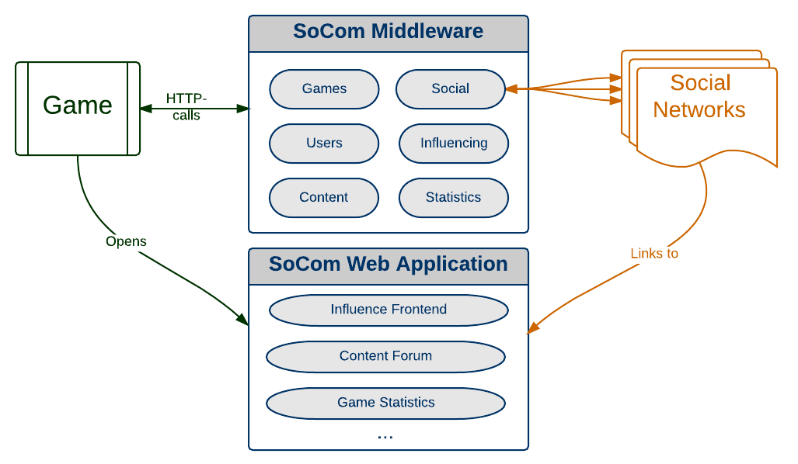

# [SoCom](https://jkonert.github.io/socom/) - the Social Communication Middleware

Ever wanted to connect your app to manifold social web applications? SoCom provides a middleware stub to mediate content exchange between your app and social media applications (like g+, fb, twitter..). Users create accounts within the middleware (white labeled if you like) and add/remove access rights to various social applications. Thus your app can simply access aggregated profile info and spread/post to various social hubs in the name of the user seamlessly.

See the [Github Website](http://jkonert.github.io/socom/)

## What is it?
SoCom is a middleware that allows easy connection of any arbitrary application (e.g. standalone game app) with *all* social media applications to enhance game experience and support player-to-player interaction.

## Features
* Servlet-based backend REST API

* GWT-based web frontend for players 

* Generic social network sharing functions for

	* Game-triggered influencing mechanisms

	* Game content (texts, images, audio, binary, ...)

* Game influencing web frontend for voting, content uplods, etc.

* Content discussion forum*
 
* Player behavior analyzation (per game statistics)

## How to (using Eclipse IDE)

1. Prerequesites:

	* [Google Plugin for Eclipse](https://developers.google.com/eclipse/docs/getting_started)
	* [Google Web Toolkit SDK 2.4.0](https://developers.google.com/eclipse/docs/getting_started)

2. Eclipse import projects: SoComFacebookAPI, SocomAPI, SocomClientGUI, SocomWeb and SocomWebGraph.

3. GWT-Compile SocomWeb (creates the war directory containing the web frontend)

4. Copy compiled war directory to SocomAPI project.

5. Customize war/WEB-INF/socomconfig.ini and database/server.properties files if needed

6. Start de.tud.kom.socom.DeploySocom class

7. SocomAPI is reachable at `http://localhost:8080/servlet/[component]/[function]` and the web frontend at `http://localhost:8080/web`

There is a lightweight, yet more detailed [HOWTO](https://github.com/jkonert/socom/blob/master/Doku/Socom%20nutzen/starten.pdf) for first steps (currently only in German).

## API

The backend REST API can be reached with generic HTTP Requests. If the SoCom server runs on the local machine on port 8080, it's URL is `http://localhost:8080/servlet/[component]/[function]`, whereas the `component` and `function` are placeholders for the desired component and its function. In general, parameters must be provided in the url (e.g. `[..]?parameter=value2&another=value2`). The API consists of 8 components:

* **game**: general game functionality (create games, game instances, ...)
* **user**: general user functionality (register, login, logout, ...)
* **social**: manages connections to social networks and provides interaction with those
* **influence**: game-influencement functionality
* **content**: game-/user-generated content functionality
* **statistics**: statistics about games
* **report**: enables reporting of user-generated content
* **achievements**: per game achievement support

The [API documentation](https://github.com/jkonert/socom/blob/master/Doku/API%20Table/Englisch%2C%20neu/apitable.pdf) shows all contained methods for each component that can be called within the API.

And there is a generated [JavaDoc](https://github.com/jkonert/socom/blob/master/SocomAPI/doc_api/index.html) available.

### Java Test Client

There exists a small API-call client which lets you build, inspect and execute URLs for all API methods. It can be started executing the de.tud.socom.client.gui.ClientGuiFrame class. By default it expects the API at the localhost, which can be changed in the menu bar.

## Web Frontend

The web frontend is started automatically with the API and can be used by users to browse users, content, influences and more. Furthermore it allows administration and game-statistics for game developers. The address is similar to the API servlet address, replacing the `servlet` token with `web`, thus for instance `http://localhost:8080/web`.

## Screenshots

The game/user can ask others to answer questions to influence the game in any manner. # retuschieren

The results can be fetched by the game, but also be viewed in the web application. # image influence instead

The frontend generates a scene-map for game administrators where they can find statistics about the gaming behavior.

